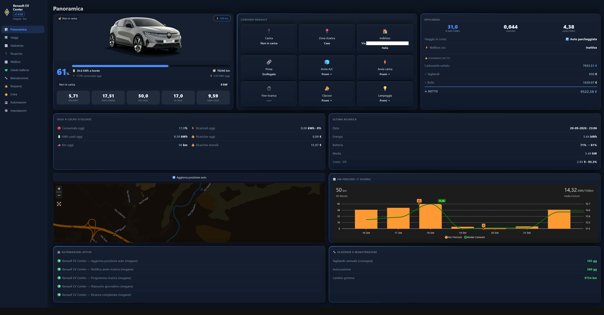
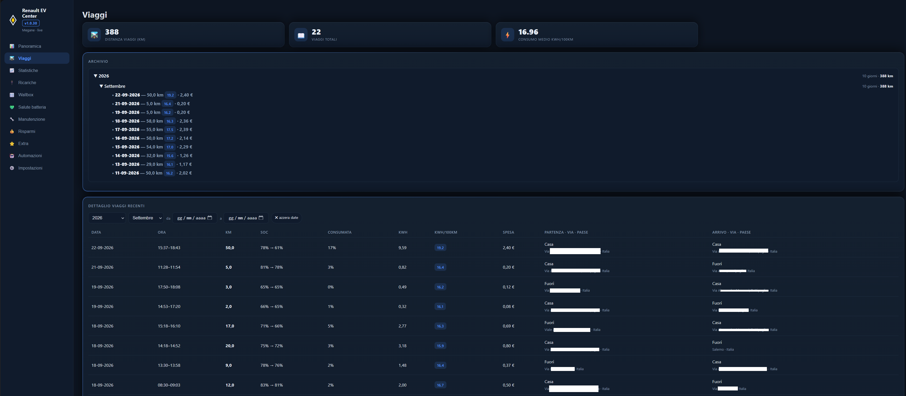
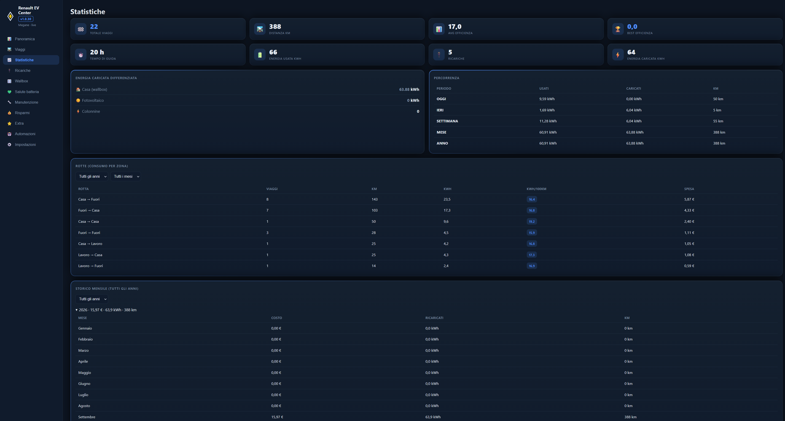
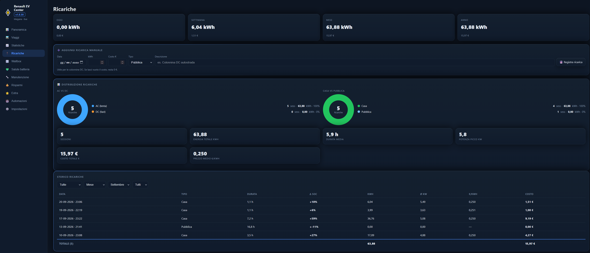
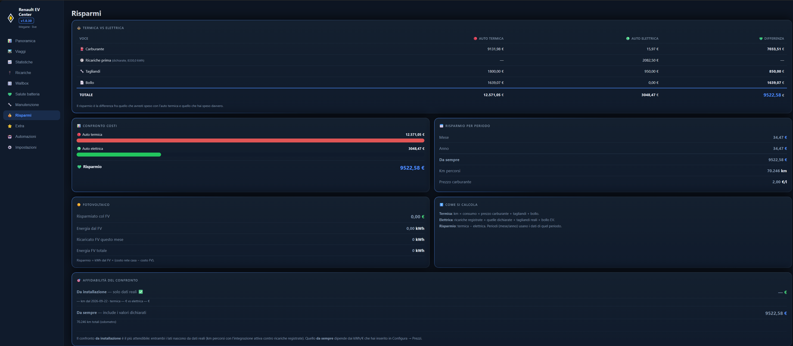
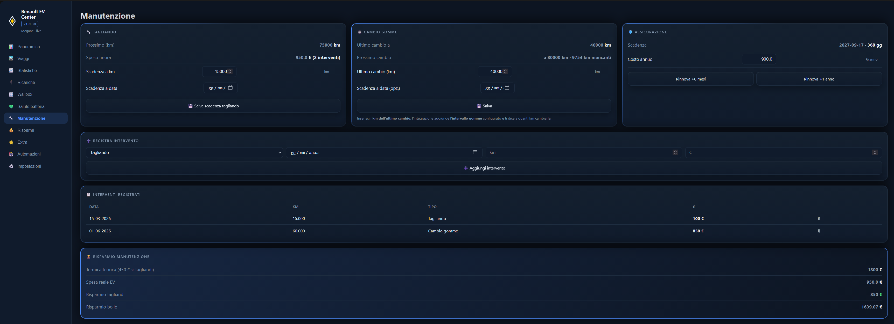

<p align="center">
  
</p>

# Renault EV Center

<p align="left">
  <a href="https://github.com/Redrex85/Renault-EV-Center-Home-Assistant/releases"></a>
  
</p>

**Viaggi, consumi, costi e ricariche per le tue Renault elettriche — direttamente in Home Assistant.**

Un *companion* per **Megane E-Tech, Scenic E-Tech, Zoe, Twingo E-Tech, Renault 5 e Renault 4 **, costruito sopra l'integrazione **Renault ufficiale di Home Assistant**: nessun account extra, nessun cloud, nessuna riga di codice. Installi da HACS, scegli le entità dalla lista, e via.

☕ Sostieni il progetto

Renault EV Center è un progetto gratuito e open source, portato avanti nel tempo libero. Se ti torna utile, puoi offrirmi un caffè per sostenere i prossimi aggiornamenti — grazie di cuore! ☕

<p align="left">
  <a href="https://www.paypal.me/lamortella"></a>
  <a href="https://www.buymeacoffee.com/redrex72v"></a>
</p>

> 🇬🇧 [English below](#-english) · 🇫🇷 [Français](#-français)

---

## ✨ Cos'è

L'integrazione **Renault** ti dà i numeri grezzi (% batteria, autonomia, odometro). **Renault EV Center** li trasforma in quello che manca:

| | |
|---|---|
| 🛣️ **Viaggi automatici** | Rileva ogni spostamento dall'odometro, calcola km, batteria consumata, kWh ed efficienza (kWh/100km), chiude il viaggio da solo dopo la sosta, con **costo stimato** e **fonte dell'ultima ricarica** prima della partenza |
| ⚡ **Ricariche** | Sessioni con energia wallbox (AC) misurata, SoC iniziale→finale, durata, tipo (Casa/Fotovoltaico/Pubblica) e costo reale |
| 🔌 **Wallbox** | Pagina dedicata: stato live, potenza, corrente, tensione, temperatura e motivo limite; **tempo e kWh di sessione** (con contatore interno di riserva); **limite di carica in A**; **avvio e stop carica** con entità mappabili in configurazione; **bilanciamento solare** a inseguimento del surplus |
| 🔋 **Surplus batteria (anche di notte)** | L'auto carica dalla **batteria di casa**: il bilanciamento somma la **scarica della batteria** al surplus e regola gli ampere della wallbox per tenere il prelievo da rete ~0 — di notte l'auto **segue la batteria, non la rete**. La *Sessione corrente* conta solo se **questa** auto è collegata/in carica (wallbox condivisa con altre auto) |
| 🔎 **Lista ricariche filtrabile** | Filtri per tipo e periodo (settimana/mese/anno/tutto) con **somma automatica** di kWh e € |
| 💰 **Costi veri** | €/km, €/100km, costo ricariche giorno/settimana/mese/anno/totale, prezzi separati per casa/colonnina/fotovoltaico modificabili **dalla dashboard** |
| 📊 **Statistiche e report** | Contatori con `last_period` (come utility_meter), tabelle **Generale/Settimanale/Mensile**, storico 365 giorni, report mensile |
| 🔋 **Stime ricarica** | Tempo residuo, ora di completamento prevista, energia mancante e costo stimato verso il tuo % obiettivo |
| 🌿 **Risparmio vs termica** | Quanti euro hai risparmiato rispetto alla tua vecchia diesel/benzina (totale, mese, anno) |
| 💚 **Salute batteria** | Efficienza di ricarica (mai >100%), **energia dispersa**, breakdown rete/batteria, SOH stimato dalle ricariche e **SOH ufficiale** della concessionaria, kWh per 1% |
| 🔧 **Manutenzione** | Registro tagliandi con spesa reale, prossimo tagliando **a scelta per km o data**, **assicurazione** con rinnovo +6 mesi/+1 anno/data e costo annuo |
| 🤖 **Automazioni integrate** | Notifica avvio/fine ricarica (con kWh, SoC e costo), **promemoria batteria bassa** a casa (% e fascia oraria), **carica programmata** via wallbox (per orario **o** percentuale) — tutto on/off e regolabile dalla vista Automazioni |
| 🖼️ **Installazione guidata** | Scelta del **modello** (imposta la foto dell'auto) e **dashboard creata automaticamente** nella barra laterale con tutte le 10+ viste già configurate |
| 📱 **Vista Mobile** | Pagina compatta pensata per il telefono; tutte le altre viste si adattano comunque allo schermo |
| 🛣️ **Viaggi verificati** | Doppia verifica all'arrivo: chiusura immediata se colleghi la carica + **coordinate GPS reali** salvate per ogni viaggio |
| 📈 **Pagina Extra** | 8 grafici di analisi: trend mensile kWh/100km, efficienza per zona, **vampire drain + costo €/mese + prezzo €/kWh su una riga**, risparmio vs termica, orario di partenza, **range reale vs dichiarato (nel box Top & Stop)** |
| 📍 **Cronologia posizione** | Timeline dei cambi di zona (In casa / Lavoro / Non disponibile) con orario, dentro il pannello |

Tutto è calcolato **localmente nel tuo Home Assistant** e salvato in `.storage` (persistente tra riavvii). Niente pyscript, niente package YAML, niente utility_meter da configurare a mano.

## 🖼️ Anteprima

*Clicca su una schermata per ingrandirla.*

<table>
  <tr>
    <td width="33%"><a href="docs/screenshots/panoramica.png"></a></td>
    <td width="33%"><a href="docs/screenshots/viaggi.png"></a></td>
    <td width="33%"><a href="docs/screenshots/statistiche.png"></a></td>
  </tr>
  <tr>
    <td width="33%"><a href="docs/screenshots/ricariche.png"></a></td>
    <td width="33%"><a href="docs/screenshots/risparmi.png"></a></td>
    <td width="33%"><a href="docs/screenshots/salute%20batteria.png"></a></td>
  </tr>
  <tr>
    <td width="33%"><a href="docs/screenshots/manutenzione.png"></a></td>
    <td width="33%"></td>
    <td width="33%"></td>
  </tr>
</table>

## 📦 Requisiti

1. Home Assistant **2025.11+** (le dashboard usano la card nativa *metric*)
2. L'integrazione **[Renault](https://www.home-assistant.io/integrations/renault/)** configurata (con il veicolo collegato)
3. *(Opzionale)* Una wallbox integrata in HA: Wallbox, go-e, Easee, Zappi, OCPP, Shelly EM dedicato…

> ⚠️ **Fortemente consigliato**: in Home Assistant definisci **almeno la zona Casa**
> (Impostazioni → **Zone** → nome `Casa` + latitudine/longitudine) e configura il
> **tracker GPS dell'auto**. Senza la zona `home` l'integrazione **non distingue una
> ricarica a casa da una colonnina pubblica**: tutto finisce come *Pubblica*, i prezzi
> casa/fotovoltaico non si applicano e le statistiche di costo si sbagliano.

> ⚠️ **Alcuni valori si popolano solo guidando**: viaggi, kWh/100km, efficienza per
> zona, orario di partenza, range reale, storico mensile e risparmi restano vuoti finché
> l'auto non percorre **qualche decina di km** con l'integrazione attiva. Subito dopo
> l'installazione è normale vedere ancora `—`.

> Funziona anche senza wallbox: le ricariche pubbliche vengono stimate dal delta SoC e puoi registrarle a mano col servizio `add_manual_charge`.

## 🔧 Installazione

### Via HACS (consigliato)

1. **HACS** → ⋮ → **Repository personalizzati**
2. Incolla `https://github.com/Redrex85/Renault-EV-Center-Home-Assistant`
3. Categoria: **Integrazione** e poi premi **Aggiungi**
4. Cerca **Renault EV Center** → Scarica
5. **Riavvia Home Assistant**
6. **Impostazioni → Dispositivi e servizi → Aggiungi integrazione → "Renault EV Center"**

> ⚠️ **Dopo aver aggiunto l'integrazione a volte la dashboard non si apre**: la prima volta che apri il
> pannello può risultare vuoto o non caricato. **Riavvia nuovamente Home Assistant** (una seconda volta)
> e ricarica la pagina con **Ctrl+Shift+R**. Serve perché la dashboard e le risorse vengono copiate
> durante il setup e HA ha bisogno di un ciclo completo per registrarle.

### Manuale

Copia la cartella `custom_components/renault_ev_center/` dentro `<config>/custom_components/`, riavvia e aggiungi l'integrazione dal menu.

## 🧙 Configurazione (4 schermate)

### 0️⃣ Il profilo

La **prima schermata** chiede il **profilo**: decide quali sezioni del wizard e quali pagine del pannello avrai. Scegli in base a cosa possiedi:

| Profilo | Per chi | Cosa include | Cosa devi inserire |
|---|---|---|---|
| **Base** | solo l'auto | auto, viaggi, statistiche, ricariche (anche **pubbliche**), risparmi, **manutenzione e bollo**, **notifiche**, **confronto carburante** e **avanzate** | nome auto + entità Renault (schermata 1️⃣) |
| **Pro** | auto **+ wallbox** | tutto il Base **+ wallbox** (avvio/stop, potenza, sessione, GSE) | Base **+ schermata 2️⃣** (wallbox) |
| **Enterprise** | auto + wallbox **+ fotovoltaico** | tutto il Pro **+ fotovoltaico** e bilanciamento solare | Pro **+ sensori rete/batteria** della sezione *Fotovoltaico* |

- **Base** → la **pagina Wallbox non compare** nel pannello; tutte le altre sì (comprese manutenzione/bollo, notifiche, confronto carburante e avanzate).
- **Pro / Enterprise** → compaiono anche le schermate della **wallbox** e (solo Enterprise) del **fotovoltaico**.
- Cambi idea? Si può cambiare quando vuoi da ⚙️ **Integrazioni → Renault EV Center → Configura**.

### 1️⃣ L'auto

Dai un nome breve all'auto (es. `Renault`) — diventa il prefisso di tutte le entità create (`sensor.renault_…`). Poi seleziona:

| Campo | Entità tipica dell'integrazione Renault |
|---|---|
| Modello | Megane E-Tech, Scenic E-Tech, Zoe, Twingo, A290 → imposta la **foto dell'auto** |
| Crea dashboard | Crea da sola la plancia laterale con tutte le viste |
| Odometro | `sensor.mileage` |
| Batteria (%) | `sensor.battery_level` |
| Autonomia | `sensor.battery_autonomy` |
| In carica | `binary_sensor.charging` oppure `sensor.charge_state` |
| Spina (opz.) | `sensor.plug_state` |
| GPS (opz.) | `device_tracker.location` |

### 2️⃣ La wallbox

Attiva l'interruttore se hai una wallbox in HA e mappa i sensori:

| Campo | Esempi |
|---|---|
| Potenza istantanea | `sensor.wallbox_instant_power` (W o kW — conversione automatica) |
| Stato wallbox | `sensor.wallbox_charger_state` (cerca lo stato tipo *charging*) |
| Contatore energia sessione | kWh della sessione corrente |
| Contatore energia totale | kWh totali erogati (usato se manca quello di sessione) |
| Avvio/stop carica (per l'automazione) | switch o button della wallbox |
| Target di carica (fallback stop) | `number.*charge_target` Renault |

### 3️⃣ Impostazioni

Capacità batteria (**60 kWh** per Megane EV60, 40 per EV40), % obiettivo ricarica, prezzi **casa/colonnina/fotovoltaico**, nome della zona FV (es. `beb`), intervallo aggiornamento, minuti di timeout viaggi, e opzionale confronto con auto termica (consumo e prezzo del gasolio/benzina).

Tutto è modificabile dopo: ⚙️ **Integrazioni → Renault EV Center → Configura**.

## 📈 Cosa crea

Oltre **90 entità** sul dispositivo *"Renault EV Center"* (prefisso = nome scelto):

```
Sensori      Km G/S/M/A (+last_period) · Energia Caricata G/S/M/A/Tot · Costo Ricarica G/S/M/A/Tot
             Km per kWh · kWh/100km · Costo/km · Costo/100km · kWh Totali · %/100km
             Batteria kWh · % Caricata/Scaricata Oggi · Energia Batteria (periodi)
             Tempo/Completamento/Costo Ricarica · Tipo Ricarica · Ultima Ricarica · Ricariche
             Trip Attivo · Km/Durata Trip · Ultimo Trip (con GPS e verifica) · Viaggi Oggi
             Statistiche Viaggi (7/30/90/totale) · Archivio · Percorrenza · Report Generale
             Efficienza Ricarica · Perdite · Energia Batteria Ultima Ricarica · kWh per 1%
             SOH Stimato · Risparmi (termica/tagliandi/bollo/netto) · CO2 · Tagliandi
             Vampire Drain · Consumo per Zona · Scadenze · Viaggio Top/Stop · FV Mese
Binary       In Carica · Wallbox in Carica
Switch       Notifica Avvio/Fine Ricarica · Promemoria Batteria Bassa · Carica Programmata
Number       Costo Casa/Colonnina/FV · Capacità · Obiettivo Ricarica · SOH Ufficiale
             Costo Assicurazione · % Promemoria · % Avvio/Stop Carica
Time         Promemoria Inizio/Fine · Carica Orario Avvio/Stop
Select       Filtro Tipo/Periodo/Anno Ricariche
Pulsanti     Chiudi Viaggio · Esporta CSV · Reset Km/Energia/Costi
```

## 🎛️ Dashboard incluse (create automaticamente)

Alla configurazione viene creata **da sola** la dashboard laterale con tutte le viste
(opzione disattivabile; servizio `renault_ev_center.create_dashboard` per ricrearla):

| Vista | Contenuto |
|---|---|
| Panoramica | Foto auto, batteria, efficienza, comandi Renault, mappa, box Risparmi |
| Viaggi | Albero Anno→Mese→Giorno stile LeapMotor + dettaglio con spesa e verifica GPS |
| Statistiche | Tile totali, percorrenza, ricariche differenziate, anno→mese + grafici |
| Ricariche | Filtri tipo/periodo/**anno**, lista stile app (Δ%, ØkW), tabelle G/S/M |
| Salute batteria | SOH ufficiale (inline) e stimato, rete/batteria/dispersa |
| Manutenzione | Tagliandi (km o data) + Assicurazione (rinnovi, costo) |
| Risparmi | Carburante, tagliandi (termica 450 € − reale), bollo, netto, FV |
| Extra | Vampire drain, rotte, meteo, CO₂, scadenze, top&stop, Energy Dashboard |
| Automazioni | Interruttori + % e orari delle automazioni integrate |
| Impostazioni | Prezzi, batteria, reset, export |
| Mobile | Vista compatta per il telefono |

Card custom opzionali (HACS → Frontend), usate **solo** dalle dashboard YAML in `dashboards/`:
**apexcharts-card** e **mini-graph-card** (grafici in `01_panoramica.yaml` e `04_ricariche.yaml`).
Il pannello laterale (`renault-ev-center-panel.js`) **non ne ha bisogno**: disegna tutto da sé.
Foto dell'auto: scelta dal modello nel wizard o personale in `/config/www/renault-ev-center/auto.png`.

> Se la tua auto non si chiama "Renault", sostituisci `sensor.renault_` con il prefisso giusto.

In [`examples/automazioni_esempio.yaml`](examples/automazioni_esempio.yaml) trovi notifiche pronte: ricarica completata, batteria bassa fuori casa, riassunto serale.

## 🛠️ Servizi

```yaml
# Chiude subito il viaggio in corso
service: renault_ev_center.close_trip

# Azzera contatori (scope: km | energia | costi | viaggi | ricariche | all)
service: renault_ev_center.reset_counters
data: { scope: km }

# Registra una ricarica pubblica non misurata dalla wallbox
service: renault_ev_center.add_manual_charge
data: { kwh: 24.8, costo: 11.90, tipo: Pubblica }

# Esporta tutti i viaggi in CSV (config/renault_ev_center_export/)
service: renault_ev_center.export_trips_csv

# (Ri)crea la dashboard laterale con tutte le viste
service: renault_ev_center.create_dashboard

# Crea in HA le 3 automazioni consigliate
service: renault_ev_center.create_automations

# Manutenzione e assicurazione
service: renault_ev_center.add_maintenance
data: { data: "2026-08-20", km: 68718, costo: 85, tipo: "Tagliando" }
service: renault_ev_center.renew_insurance
data: { mesi: 12 }

# Scadenze e tagliando
service: renault_ev_center.set_scadenza
data: { nome: bollo, data: "2026-10-12" }
service: renault_ev_center.set_tagliando
data: { mode: km, valore: "71218" }
```

## ❓ FAQ

**Come viene calcolato il tempo di viaggio?** Il viaggio si apre quando l'odometro aumenta e si chiude **dopo ~20 minuti senza movimenti** — in pratica quando **spegni l'auto** e odometro/posizione si aggiornano (il cloud Renault ha qualche minuto di ritardo). La durata registrata va dall'inizio all'**ultimo movimento rilevato**: la sosta post-viaggio non viene conteggiata. Finché l'auto è accesa il viaggio appare come "Trip Attivo" con dati provvisori.

**Le zone di Home Assistant compaiono nei viaggi?** Sì. Se in HA hai definito le **zone** (Casa, Lavoro, ecc.) e hai configurato il tracker GPS dell'auto, ogni viaggio registra **zona di partenza e di arrivo** e le **percorrenze/statistiche** riportano i km per zona.

**I sensori Renault restano "non disponibili" a volte.** È normale: il cloud Renault aggiorna lentamente. Mate tollera i buchi e riprende quando i dati tornano. Se vuoi un aiuto in più, esiste l'automazione classica di ricarica dell'integrazione Renault ogni ora.

**Le entità hanno ID diversi da quelli delle dashboard?** Le dashboard usano il prefisso del nome che hai dato all'auto in minuscolo. Rinomina l'entry o cerca/sostituisci nei file YAML.

**Ho aggiunto l'integrazione ma i sensori non compaiono.** A volte serve **riavviare Home Assistant** dopo la creazione dell'entry, perché l'integrazione carichi tutte le piattaforme (sensori, switch, select, time). Riavvia e ricontrolla.

**Posso avere due auto?** Sì: aggiungi una seconda istanza dell'integrazione con un altro nome.

**Dove sono i miei dati?** In `.storage/renault_ev_center.<entry_id>` — restano tuoi, nessun invio esterno.

Hai un'idea? Apri una issue!

## 🤝 Crediti e disclaimer

- Ispirato a [LeapMotor Mate](https://github.com/ProtossBlaster/leapmotor-mate) e a TeslaMate.
- Richiede l'[integrazione Renault](https://www.home-assistant.io/integrations/renault/) di Home Assistant.
- Progetto **non ufficiale**, non affiliato a Renault. I dati dipendono dall'affidabilità dei sensori che configuri.

Licenza: **MIT** — vedi [LICENSE](LICENSE).

---

# 🇬🇧 English

**Trips, consumption, costs and charging for your Renault EVs — fully inside Home Assistant.**

A companion for **Megane E-Tech, Scenic E-Tech, Zoe, Twingo E-Tech, Renault 5 and Renault 4**, built on top of the official **Home Assistant Renault integration**. No extra accounts, no cloud, no code: install from HACS, pick your entities from dropdowns, done.

☕ Support

Renault EV Center is a free, open-source project kept alive in my spare time. If it saves you time, you can buy me a coffee to support the next updates — thank you so much! ☕

<p align="left">
  <a href="https://www.paypal.me/lamortella"></a>
  <a href="https://www.buymeacoffee.com/redrex72v"></a>
</p>

> 🇮🇹 [Italian above](#-cosè) · 🇫🇷 [Français](#-français)

### What it is

The **Renault** integration gives you the raw numbers (battery %, range, odometer). **Renault EV Center** turns them into what's missing:

| | |
|---|---|
| 🛣️ **Automatic trips** | Detects every move from the odometer, computes km, battery used, kWh and efficiency (kWh/100km), auto-closes the trip after the stop, with **estimated cost** and the **source of the last charge** before departure |
| ⚡ **Charges** | Sessions with measured wallbox (AC) energy, initial→final SoC, duration, type (Home/Solar/Public) and real cost |
| 🔌 **Wallbox** | Dedicated page: live state, power, current, voltage, temperature and limit reason; **session time & kWh** (with internal fallback counter); **charge limit in A**; **start and stop charging** with entities mapped in the config flow; **solar balancing** that follows your surplus |
| 🔋 **Battery surplus (even at night)** | The car charges from the **home battery** — the balancing adds the **battery discharge** to the surplus and keeps grid import ~0, so at night the car **follows the battery, not the grid**. The *Current session* only counts if **this** car is plugged in/charging (wallbox shared with other cars) |
| 🔎 **Filterable charge list** | Filters by type and period (week/month/year/all) with **automatic** kWh and € totals |
| 💰 **Real costs** | €/km, €/100km, charge cost per day/week/month/year/all-time, separate home/public/solar tariffs editable **from the dashboard** |
| 📊 **Statistics and reports** | Meters with `last_period` (utility_meter style), **General/Weekly/Monthly** tables, 365-day history, monthly report |
| 🔋 **Charge estimates** | Time remaining, expected completion time, missing energy and estimated cost toward your target % |
| 🌿 **Savings vs combustion** | How many euros you saved against your old diesel/petrol car (total, month, year) |
| 💚 **Battery health** | Charging efficiency (never >100%), **energy lost**, grid/battery breakdown, SOH estimated from charges and **official dealer SOH**, kWh per 1% |
| 🔧 **Maintenance** | Service log with real spend, next service **by km or date**, **insurance** with +6 months/+1 year/date renewal and yearly cost |
| 🤖 **Built-in automations** | Charge start/finish notification (with kWh, SoC and cost), **low-battery reminder** at home (% and time window), **scheduled charging** via wallbox (by time **or** percentage) — all switchable and tunable from the Automations view |
| 🖼️ **Guided setup** | Car **model** selection (sets the car photo) and **auto-created dashboard** in the sidebar with all 10+ views ready |
| 📱 **Mobile view** | Compact phone layout; every other view adapts to small screens too |
| 🛣️ **Verified trips** | Double check on arrival: instant close when you plug in + **real GPS coordinates** saved for every trip |
| 📈 **Extra page** | 8 analysis charts: monthly kWh/100km trend, efficiency per zone, weekly vampire drain, **monthly charge cost**, **average €/kWh**, savings vs combustion, departure time, **real vs declared range (in the Top & Stop box)** |
| 📍 **Position history** | Timeline of zone changes (Home / Work / Unavailable) with times, inside the panel |

Everything is computed **locally in your Home Assistant** and saved to `.storage` (persistent across restarts). No pyscript, no YAML packages, no utility_meter to wire by hand.

### Preview

*Click a screenshot to enlarge it.*

<table>
  <tr>
    <td width="33%"><a href="docs/screenshots/panoramica.png"></a></td>
    <td width="33%"><a href="docs/screenshots/viaggi.png"></a></td>
    <td width="33%"><a href="docs/screenshots/statistiche.png"></a></td>
  </tr>
  <tr>
    <td width="33%"><a href="docs/screenshots/ricariche.png"></a></td>
    <td width="33%"><a href="docs/screenshots/risparmi.png"></a></td>
    <td width="33%"><a href="docs/screenshots/salute%20batteria.png"></a></td>
  </tr>
  <tr>
    <td width="33%"><a href="docs/screenshots/manutenzione.png"></a></td>
    <td width="33%"></td>
    <td width="33%"></td>
  </tr>
</table>

### Requirements

1. Home Assistant **2025.11+** (the dashboards use the native *metric* card)
2. The **[Renault](https://www.home-assistant.io/integrations/renault/)** integration configured (with the vehicle linked)
3. *(Optional)* A wallbox integrated into HA: Wallbox, go-e, Easee, Zappi, OCPP, Shelly EM…

> ⚠️ **Strongly recommended: at least the Home zone.** In HA go to **Settings → Zones**
> and make sure a `Home` zone exists (correct latitude/longitude) with the **car GPS
> tracker** inside it. Without the `home` zone the integration **cannot tell a home
> charge from a public charger**: everything is logged as *Public* and the home/solar
> prices never apply, so the cost statistics are wrong.

> ⚠️ **Some values only populate after driving**: trips, kWh/100km, per-zone efficiency,
> departure time, real range, monthly history and savings stay empty until the car has
> covered **a few tens of km** with the integration active. Seeing `—` right after
> install is normal.

> Works without a wallbox too: public charges are estimated from the SoC delta and you can log them manually with the `add_manual_charge` service.

### Installation

**Via HACS (recommended)**

1. **HACS** → ⋮ → **Custom repositories**
2. Paste `https://github.com/Redrex85/Renault-EV-Center-Home-Assistant`
3. Category: **Integration**, then press **Add**
4. Search **Renault EV Center** → Download
5. **Restart Home Assistant**
6. **Settings → Devices & Services → Add Integration → "Renault EV Center"**

> ⚠️ **After adding the integration the dashboard sometimes doesn't open**: the first time
> you open the panel it may look empty or unloaded. **Restart Home Assistant again**
> (a second time) and reload the page with **Ctrl+Shift+R**. The dashboard and its
> resources are copied during setup and HA needs a full cycle to register them.

**Manual**

Copy the `custom_components/renault_ev_center/` folder into `<config>/custom_components/`, restart and add the integration from the menu.

### Setup (4 screens)

#### 0️⃣ The profile

The **first screen** asks for the **profile**: it decides which wizard sections and which panel pages you get. Pick it based on what you own:

| Profile | For | Includes | You fill in |
|---|---|---|---|
| **Base** | car only | car, trips, statistics, charges (including **public**), savings, **maintenance and road tax**, **notifications**, **fuel comparison** and **advanced** | car name + Renault entities (screen 1️⃣) |
| **Pro** | car **+ wallbox** | all of Base **+ wallbox** (start/stop, power, session, GSE) | Base **+ screen 2️⃣** (wallbox) |
| **Enterprise** | car + wallbox **+ solar** | all of Pro **+ solar** and solar balancing | Pro **+ grid/battery sensors** from the *Solar* section |

- **Base** → the **Wallbox page is hidden** in the panel; every other page shows (including maintenance/road tax, notifications, fuel comparison and advanced).
- **Pro / Enterprise** → the **wallbox** screen appears too, plus **solar** (Enterprise only).
- Changed your mind? Switch any time from ⚙️ **Settings → Devices & Services → Renault EV Center → Configure**.

#### 1️⃣ The car

Give the car a short name (e.g. `Renault`) — it becomes the prefix of every created entity (`sensor.renault_…`). Then select:

| Field | Typical Renault integration entity |
|---|---|
| Model | Megane E-Tech, Scenic E-Tech, Zoe, Twingo, A290 → sets the **car photo** |
| Create dashboard | Builds the sidebar dashboard with all views |
| Odometer | `sensor.mileage` |
| Battery (%) | `sensor.battery_level` |
| Range | `sensor.battery_autonomy` |
| Charging | `binary_sensor.charging` or `sensor.charge_state` |
| Plug (opt.) | `sensor.plug_state` |
| GPS (opt.) | `device_tracker.location` |

#### 2️⃣ The wallbox

Flip the switch if you have a wallbox in HA and map the sensors:

| Field | Examples |
|---|---|
| Instant power | `sensor.wallbox_instant_power` (W or kW — auto conversion) |
| Wallbox state | `sensor.wallbox_charger_state` (look for a *charging*-like state) |
| Session energy counter | kWh of the current session |
| Total energy counter | Total kWh delivered (used when the session counter is missing) |
| Start/stop charging (for automations) | wallbox switch or button |
| Charge target (stop fallback) | Renault `number.*charge_target` |

#### 3️⃣ Settings

Battery capacity (**60 kWh** for Megane EV60, 40 for EV40), target charge %, **home/public/solar** prices, solar zone name (e.g. `beb`), update interval, trip timeout minutes, and optional comparison with a combustion car (fuel consumption and diesel/petrol price).

Everything is editable later: ⚙️ **Settings → Devices & Services → Renault EV Center → Configure**.

### What it creates

Over **90 entities** on the *"Renault EV Center"* device (prefix = the name you chose):

```
Sensors    Km D/W/M/Y (+last_period) · Energy Charged D/W/M/Y/Total · Charge Cost D/W/M/Y/Total
           Km per kWh · kWh/100km · Cost/km · Cost/100km · Total kWh · %/100km
           Battery kWh · % Charged/Discharged Today · Battery Energy (periods)
           Charge Time/Completion/Cost · Charge Type · Last Charge · Charges
           Active Trip · Trip Km/Duration · Last Trip (with GPS and check) · Trips Today
           Trip Statistics (7/30/90/all) · Archive · Mileage · General Report
           Charge Efficiency · Losses · Last Charge Battery Energy · kWh per 1%
           Estimated SOH · Savings (fuel/service/road tax/net) · CO2 · Services
           Vampire Drain · Consumption per Zone · Deadlines · Top/Stop Trip · Solar Month
Binary     Charging · Wallbox Charging
Switch     Charge Start/Finish Notification · Low Battery Reminder · Scheduled Charging
Number     Home/Public/Solar Price · Capacity · Charge Target · Official SOH
           Insurance Cost · Reminder % · Start/Stop Charge %
Time       Reminder Start/End · Scheduled Charge Start/Stop
Select     Charge Type/Period/Year Filter
Buttons    Close Trip · Export CSV · Reset Km/Energy/Costs
```

### Included dashboards (created automatically)

On setup the sidebar dashboard is **created for you** with every view
(disableable; service `renault_ev_center.create_dashboard` to rebuild it):

| View | Contents |
|---|---|
| Overview | Car photo, battery, efficiency, Renault controls, map, Savings box |
| Trips | Year→Month→Day tree, LeapMotor style, with cost detail and GPS check |
| Statistics | Total tiles, mileage, split charges, year→month + charts |
| Charges | Type/period/**year** filters, app-style list (Δ%, ØkW), D/W/M tables |
| Battery health | Official SOH (inline) and estimated, grid/battery/lost |
| Maintenance | Services (km or date) + Insurance (renewals, cost) |
| Savings | Fuel, services (combustion 450 € − actual), road tax, net, solar |
| Extra | Vampire drain, routes, weather, CO₂, deadlines, top&stop, Energy Dashboard |
| Automations | Switches + % and times of the built-in automations |
| Settings | Prices, battery, reset, export |
| Mobile | Compact phone view |

Optional custom cards (HACS → Frontend), used **only** by the YAML dashboards in `dashboards/`:
**apexcharts-card** and **mini-graph-card** (charts in `01_panoramica.yaml` and `04_ricariche.yaml`).
The side panel (`renault-ev-center-panel.js`) **doesn't need them**: it draws everything itself.
Car photo: chosen from the model in the wizard or personal, in `/config/www/renault-ev-center/auto.png`.

> If your car isn't called "Renault", replace `sensor.renault_` with the right prefix.

[`examples/automazioni_esempio.yaml`](examples/automazioni_esempio.yaml) has ready notifications: charge finished, low battery away from home, evening summary.

### Services

```yaml
# Closes the current trip immediately
service: renault_ev_center.close_trip

# Resets meters (scope: km | energia | costi | viaggi | ricariche | all)
service: renault_ev_center.reset_counters
data: { scope: km }

# Logs a public charge not measured by the wallbox
service: renault_ev_center.add_manual_charge
data: { kwh: 24.8, costo: 11.90, tipo: Pubblica }

# Exports all trips to CSV (config/renault_ev_center_export/)
service: renault_ev_center.export_trips_csv

# (Re)creates the side dashboard with all views
service: renault_ev_center.create_dashboard

# Creates the 3 recommended automations in HA
service: renault_ev_center.create_automations

# Maintenance and insurance
service: renault_ev_center.add_maintenance
data: { data: "2026-08-20", km: 68718, costo: 85, tipo: "Service" }
service: renault_ev_center.renew_insurance
data: { mesi: 12 }

# Deadlines and service
service: renault_ev_center.set_scadenza
data: { nome: bollo, data: "2026-10-12" }
service: renault_ev_center.set_tagliando
data: { mode: km, valore: "71218" }
```

### FAQ

**How is the trip duration calculated?** The trip opens when the odometer increases and closes **after ~20 minutes without movement** — in practice when you **turn the car off** and odometer/position update (the Renault cloud is a few minutes behind). The recorded duration runs from the start to the **last movement detected**: the post-trip stop isn't counted. While the car is on, the trip shows as "Active Trip" with provisional data.

**Do Home Assistant zones show up in trips?** Yes. If you defined **zones** (Home, Work, …) in HA and configured the car GPS tracker, every trip records **origin and destination zone** and the **mileage/statistics** report km per zone.

**The Renault sensors stay "unavailable" sometimes.** Normal: the Renault cloud updates slowly. The integration tolerates the gaps and resumes when data comes back. For extra help there's the classic automation that refreshes the Renault integration every hour.

**Entity IDs don't match the dashboards?** The dashboards use the lowercased name prefix you gave the car. Rename the entry or find/replace in the YAML files.

**I added the integration but no sensors appear.** Sometimes you need to **restart Home Assistant** after creating the entry so the integration loads all platforms (sensors, switches, select, time). Restart and check again.

**Can I have two cars?** Yes: add a second instance of the integration with a different name.

**Where is my data?** In `.storage/renault_ev_center.<entry_id>` — it stays yours, nothing is sent anywhere.

Got an idea? Open an issue!

### Credits and disclaimer

- Inspired by [LeapMotor Mate](https://github.com/ProtossBlaster/leapmotor-mate) and TeslaMate.
- Requires the Home Assistant **[Renault](https://www.home-assistant.io/integrations/renault/) integration**.
- **Unofficial** project, not affiliated with Renault. Data quality depends on the sensors you configure.

License: **MIT** — see [LICENSE](LICENSE).

---

# 🇫🇷 Français

**Trajets, consommation, coûts et recharges de vos Renault électriques — entièrement dans Home Assistant.**

Un compagnon pour **Megane E-Tech, Scenic E-Tech, Zoe, Twingo E-Tech, Renault 5 et Renault 4**, construit au-dessus de l'intégration **Renault officielle de Home Assistant**. Aucun compte supplémentaire, aucun cloud, aucun code : installez depuis HACS, choisissez vos entités dans des listes, c'est tout.


☕ Soutien

Renault EV Center est un projet gratuit et open source, développé sur mon temps libre. S'il vous fait gagner du temps, vous pouvez m'offrir un café pour soutenir les prochaines mises à jour — merci beaucoup ! ☕

<p align="left">
  <a href="https://www.paypal.me/lamortella"></a>
  <a href="https://www.buymeacoffee.com/redrex72v"></a>
</p>

> 🇮🇹 [Versione italiana in alto](#-cosè) · 🇬🇧 [English above](#-english)

## ✨ C'est quoi

L'intégration **Renault** donne les chiffres bruts (% batterie, autonomie, odomètre). **Renault EV Center** les transforme en ce qui manque :

- **Détection automatique des trajets** depuis l'odomètre : km, batterie consommée, kWh, efficacité (kWh/100km), clôture automatique après l'arrêt, avec **coût estimé**
- **Sessions de recharge** avec énergie AC mesurée par la wallbox, SoC initial→final, durée, type (Maison/Solaire/Public) et coût réel
- **Wallbox** : page dédiée avec état, puissance, courant, tension, température et raison de limitation en direct ; **durée et kWh de session** (avec compteur interne de secours) ; **limite de charge en A** ; **démarrage et arrêt de la charge** avec entités mappées dans la configuration ; **équilibrage solaire** qui suit votre surplus
- **Coûts réels** : €/km, €/100km, coûts par jour/semaine/mois/an/total, tarifs séparés maison/born publique/solaire modifiables **depuis le tableau de bord**
- **Statistiques et rapports** : compteurs avec `last_period` (style utility_meter), tableaux Général/Hebdomadaire/Mensuel, historique 365 jours
- **Estimations de recharge** : temps restant, heure de fin prévue, énergie manquante et coût estimé vers votre % cible
- **Économies vs thermique** : combien d'euros économisés par rapport à votre ancienne diesel/essence
- **Santé batterie** : efficacité de recharge (jamais >100%), **énergie perdue**, SOH estimé et **SOH officiel** du concessionnaire
- **Entretien** : registre des révisions, prochaine révision **au km ou à la date**, **assurance** avec renouvellement +6 mois/+1 an/date
- **Automatisations intégrées** : notification début/fin de charge, **rappel batterie faible** à la maison (% et plage horaire), **charge programmée** via wallbox (horaire **ou** pourcentage)
- **Installation guidée** : choix du **modèle** (photo de la voiture) et **tableau de bord créé automatiquement** dans la barre latérale avec toutes les vues
- **Liste de recharges filtrable** : filtres par type et période (semaine/mois/année/tout) avec **totaux automatiques** de kWh et €
- **Vue mobile** : page compacte pensée pour le téléphone ; les autres vues s'adaptent aussi
- **Trajets vérifiés** : double contrôle à l'arrivée : clôture immédiate si vous branchez la charge + **coordonnées GPS réelles** enregistrées pour chaque trajet
- **Page Extra** : 8 graphiques d'analyse : tendance mensuelle kWh/100 km, efficacité par zone, vampire drain hebdomadaire, **coût mensuel des recharges**, **prix moyen €/kWh**, économies vs thermique, heure de départ, **autonomie réelle vs déclarée (dans le encadré Top & Stop)**
- **Historique de position** : chronologie des changements de zone (Maison / Travail / Indisponible) avec horaires, dans le panneau

Tout est calculé **localement dans votre Home Assistant** et sauvegardé dans `.storage`
(persistant entre les redémarrages). Aucun pyscript, aucune YAML package, aucun
utility_meter à configurer à la main. Aucun envoi externe.

## 🖼️ Aperçu

*Cliquez sur une capture pour l'agrandir.*

<table>
  <tr>
    <td width="33%"><a href="docs/screenshots/panoramica.png"></a></td>
    <td width="33%"><a href="docs/screenshots/viaggi.png"></a></td>
    <td width="33%"><a href="docs/screenshots/statistiche.png"></a></td>
  </tr>
  <tr>
    <td width="33%"><a href="docs/screenshots/ricariche.png"></a></td>
    <td width="33%"><a href="docs/screenshots/risparmi.png"></a></td>
    <td width="33%"><a href="docs/screenshots/salute%20batteria.png"></a></td>
  </tr>
  <tr>
    <td width="33%"><a href="docs/screenshots/manutenzione.png"></a></td>
    <td width="33%"></td>
    <td width="33%"></td>
  </tr>
</table>

## 📦 Prérequis

1. Home Assistant **2025.11+** (les tableaux de bord utilisent la carte native *metric*)
2. L'intégration **[Renault](https://www.home-assistant.io/integrations/renault/)** configurée (véhicule relié)
3. *(Optionnel)* Une wallbox intégrée à HA : Wallbox, go-e, Easee, Zappi, OCPP, Shelly EM dédié…

> ⚠️ **Fortement recommandé : au moins la zone Maison.** Dans HA, allez dans
> **Paramètres → Zones** et vérifiez qu'une zone `Maison` existe (coordonnées correctes)
> contenant le **tracker GPS de la voiture**. Sans la zone `home`, l'intégration
> **ne distingue pas une recharge à maison d'une borne publique** : tout est classé
> *Public*, les prix maison/solaire ne s'appliquent jamais et les statistiques de
> coût sont fausses.

> ⚠️ **Certaines valeurs ne se remplissent qu'en roulant** : trajets, kWh/100 km,
> efficacité par zone, heure de départ, autonomie réelle, historique mensuel et
> économies restent vides tant que la voiture n'a pas parcouru quelques dizaines de km
> avec l'intégration active. Voir `—` juste après l'installation est normal.

> Fonctionne aussi sans wallbox : les recharges publiques sont estimées par le delta SoC et peuvent être enregistrées à la main avec le service `add_manual_charge`.

## 🔧 Installation

### Via HACS (recommandé)

1. **HACS** → ⋮ → **Dépôts personnalisés**
2. Collez `https://github.com/Redrex85/Renault-EV-Center-Home-Assistant`
3. Catégorie : **Intégration** → Ajouter
4. Recherchez **Renault EV Center** → Télécharger
5. **Redémarrez Home Assistant**
6. **Paramètres → Appareils et services → Ajouter l'intégration → "Renault EV Center"**

> ⚠️ **Après avoir ajouté l'intégration, le tableau de bord ne s'ouvre pas toujours** :
> la première fois, le panneau peut apparaître vide ou non chargé. **Redémarrez à
> nouveau Home Assistant** (une seconde fois) puis rechargez la page avec
> **Ctrl+Shift+R**. Le tableau de bord et ses ressources sont copiés pendant le setup
> et HA a besoin d'un cycle complet pour les enregistrer.

### Manuelle

Copiez le dossier `custom_components/renault_ev_center/` dans `<config>/custom_components/`, redémarrez et ajoutez l'intégration depuis le menu.

## 🧙 Configuration (4 écrans)

### 0️⃣ Le profil

Le **premier écran** demande le **profil** : il décide des sections du wizard et des pages du panneau. Choisissez selon ce que vous possédez :

| Profil | Pour qui | Contenu | À saisir |
|---|---|---|---|
| **Base** | voiture seule | voiture, trajets, statistiques, recharges (y compris **publiques**), économies, **entretien et taxe**, **notifications**, **comparaison carburant** et **avancé** | nom + entités Renault (écran 1️⃣) |
| **Pro** | voiture **+ wallbox** | tout le Base **+ wallbox** (démarrage/arrêt, puissance, session, GSE) | Base **+ écran 2️⃣** (wallbox) |
| **Enterprise** | voiture + wallbox **+ photovoltaïque** | tout le Pro **+ photovoltaïque** et équilibrage solaire | Pro **+ capteurs réseau/batterie** de la section *Photovoltaïque* |

- **Base** → la **page Wallbox n'apparaît pas** dans le panneau ; toutes les autres oui (entretien/taxe, notifications, comparaison carburant et avancé compris).
- **Pro / Enterprise** → les écrans **wallbox** et (Enterprise seulement) **photovoltaïque** apparaissent aussi.
- Changement d'avis ? Modifiable à tout moment via ⚙️ **Paramètres → Intégrations → Renault EV Center → Configurer**.

### 1️⃣ La voiture

Donnez un nom court à la voiture (ex. `Renault`) — il devient le préfixe de toutes les entités créées (`sensor.renault_…`). Puis sélectionnez :

| Champ | Entité typique de l'intégration Renault |
|---|---|
| Modèle | Megane E-Tech, Scenic E-Tech, Zoe, Twingo, A290 → définit la **photo de la voiture** |
| Créer le tableau de bord | Crée seul la plance latérale avec toutes les vues |
| Odomètre | `sensor.mileage` |
| Batterie (%) | `sensor.battery_level` |
| Autonomie | `sensor.battery_autonomy` |
| En charge | `binary_sensor.charging` ou `sensor.charge_state` |
| Prise (opt.) | `sensor.plug_state` |
| GPS (opt.) | `device_tracker.location` |

### 2️⃣ La wallbox

Activez l'interrupteur si vous avez une wallbox dans HA et mappez les capteurs :

| Champ | Exemples |
|---|---|
| Puissance instantanée | `sensor.wallbox_instant_power` (W ou kW — conversion automatique) |
| État wallbox | `sensor.wallbox_charger_state` (état type *charging*) |
| Compteur énergie session | kWh de la session en cours |
| Compteur énergie totale | kWh totaux délivrés (utilisé si pas de compteur session) |
| Démarrage/arrêt charge (automatisation) | switch ou button de la wallbox |
| Cible de charge (secours arrêt) | `number.*charge_target` Renault |

### 3️⃣ Réglages

Capacité batterie (**60 kWh** pour Megane EV60, 40 pour EV40), % cible de recharge, tarifs **maison/born publique/solaire**, nom de la zone FV, intervalle de mise à jour, minutes de timeout des trajets, et comparaison optionnelle avec une voiture thermique (consommation et prix du gasoil/essence).

Tout est modifiable après : ⚙️ **Paramètres → Intégrations → Renault EV Center → Configurer**.

## 📈 Ce que ça crée

Plus de **90 entités** sur l'appareil *"Renault EV Center"* (préfixe = le nom choisi) :

```
Capteurs   Km J/S/M/A (+last_period) · Énergie rechargée J/S/M/A/Total · Coût recharge J/S/M/A/Total
           Km par kWh · kWh/100km · Coût/km · Coût/100km · kWh total · %/100km
           kWh batterie · % Rechargé/Déchargé aujourd'hui · Énergie batterie (périodes)
           Temps/Fin/Cost recharge · Type recharge · Dernière recharge · Recharges
           Trajet actif · Km/durée trajet · Dernier trajet (avec GPS et contrôle) · Trajets du jour
           Statistiques trajets (7/30/90/total) · Archive · Kilométrage · Rapport général
           Efficacité recharge · Pertes · Énergie batterie dernière recharge · kWh par 1%
           SOH estimé · Économies (thermique/entretien/taxe/net) · CO2 · Révisions
           Vampire Drain · Consommation par zone · Échéances · Trajet Top/Stop · PV mois
Binaire    En charge · Wallbox en charge
Interrupt. Notification début/fin recharge · Rappel batterie faible · Charge programmée
Number     Prix maison/borne PV · Capacité · Cible recharge · SOH officiel
           Coût assurance · % rappel · % début/stop charge
Heure      Début/fin rappel · Début/stop charge programmée
Select     Filtre type/période/année des recharges
Boutons    Clôturer trajet · Export CSV · Reset Km/énergie/coûts
```

## 🎛️ Tableaux de bord inclus (créés automatiquement)

À la configuration, le tableau de bord latéral est **créé tout seul** avec toutes les vues
(désactivable ; service `renault_ev_center.create_dashboard` pour le recréer) :

| Vue | Contenu |
|---|---|
| Panoramica | Photo voiture, batterie, efficacité, commandes Renault, carte, encadré Économies |
| Trajets | Arbre Année→Mois→Jour style LeapMotor + détail avec dépense et contrôle GPS |
| Statistiques | Tuiles totales, kilométrage, recharges différenciées, année→mois + graphiques |
| Recharges | Filtres type/période/**année**, liste style app (Δ%, ØkW), tableaux J/S/M |
| Santé batterie | SOH officiel (inline) et estimé, réseau/batterie/perdu |
| Entretien | Révisions (km ou date) + Assurance (renouvellements, coût) |
| Économies | Carburant, révisions (thermique 450 € − réel), taxe, net, PV |
| Extra | Vampire drain, itinéraires, météo, CO₂, échéances, top&stop, Energy Dashboard |
| Automatisations | Interrupteurs + % et horaires des automatisations intégrées |
| Réglages | Prix, batterie, reset, export |
| Mobile | Vue compacte pour le téléphone |

Cartes custom optionnelles (HACS → Frontend), utilisées **seulement** par les
tableaux de bord YAML dans `dashboards/` : **apexcharts-card** et **mini-graph-card**
(graphiques dans `01_panoramica.yaml` et `04_ricariche.yaml`). Le panneau latéral
(`renault-ev-center-panel.js`) **n'en a pas besoin** : il dessine tout lui-même.
Photo de la voiture : choisie depuis le modèle dans l'assistant ou personnelle, dans
`/config/www/renault-ev-center/auto.png`.

> Si votre voiture ne s'appelle pas « Renault », remplacez `sensor.renault_` par le bon préfixe.

Dans [`examples/automazioni_esempio.yaml`](examples/automazioni_esempio.yaml) vous
trouvez des notifications prêtes : recharge terminée, batterie faible loin de la maison,
résumé du soir.

## 🛠️ Services

```yaml
# Clôture immédiatement le trajet en cours
service: renault_ev_center.close_trip

# Réinitialise les compteurs (scope: km | energia | costi | viaggi | ricariche | all)
service: renault_ev_center.reset_counters
data: { scope: km }

# Enregistre une recharge publique non mesurée par la wallbox
service: renault_ev_center.add_manual_charge
data: { kwh: 24.8, costo: 11.90, tipo: Pubblica }

# Exporte tous les trajets en CSV (config/renault_ev_center_export/)
service: renault_ev_center.export_trips_csv

# (Re)crée le tableau de bord latéral avec toutes les vues
service: renault_ev_center.create_dashboard

# Crée dans HA les 3 automatisations recommandées
service: renault_ev_center.create_automations

# Entretien et assurance
service: renault_ev_center.add_maintenance
data: { data: "2026-08-20", km: 68718, costo: 85, tipo: "Révision" }
service: renault_ev_center.renew_insurance
data: { mesi: 12 }

# Échéances et révision
service: renault_ev_center.set_scadenza
data: { nome: bollo, data: "2026-10-12" }
service: renault_ev_center.set_tagliando
data: { mode: km, valeur: "71218" }
```

## ❓ FAQ

**Comment est calculée la durée du trajet ?** Le trajet s'ouvre quand l'odomètre augmente et se ferme **après ~20 minutes sans mouvement** — en pratique quand vous **éteignez la voiture** et qu'odomètre/position se mettent à jour (le cloud Renault a quelques minutes de retard). La durée enregistrée va du départ au **dernier mouvement détecté** : l'arrêt après le trajet n'est pas compté. Tant que la voiture est allumée, le trajet apparaît comme « Trip Attivo » avec des données provisoires.

**Les zones de Home Assistant apparaissent-elles dans les trajets ?** Oui. Si vous avez
défini les **zones** (Maison, Travail, …) dans HA et configuré le tracker GPS de la
voiture, chaque trajet enregistre la **zone de départ et d'arrivée** et les
**kilométrages/statistiques** indiquent les km par zone.

**Les capteurs Renault restent parfois « indisponibles ».** C'est normal : le cloud Renault met à jour lentement. L'intégration tolère les trous et reprend quand les données reviennent. Pour un coup de main, il existe l'automatisation classique qui rafraîchit l'intégration Renault chaque heure.

**Les IDs d'entités diffèrent de ceux des tableaux de bord ?** Les tableaux utilisent le préfixe du nom donné à la voiture en minuscules. Renommez l'entrée ou cherchez/remplacez dans les fichiers YAML.

**J'ai ajouté l'intégration mais les capteurs n'apparaissent pas.** Il faut parfois
**redémarrer Home Assistant** après la création de l'entrée, pour que l'intégration
charge toutes les plateformes (capteurs, interrupteurs, select, time). Redémarrez et
revérifiez.

**Deux voitures ?** Oui : ajoutez une seconde instance de l'intégration avec un autre nom.

**Où sont mes données ?** Dans `.storage/renault_ev_center.<entry_id>` — elles restent les vôtres, aucun envoi externe.

Vous avez une idée ? Ouvrez une issue !

## 🤝 Crédits et avertissement

- Inspiré de [LeapMotor Mate](https://github.com/ProtossBlaster/leapmotor-mate) et de TeslaMate.
- Nécessite l'[intégration Renault](https://www.home-assistant.io/integrations/renault/) de Home Assistant.
- Projet **non officiel**, non affilié à Renault. Les données dépendent de la fiabilité des capteurs configurés.

Licence : **MIT** — voir [LICENSE](LICENSE).
